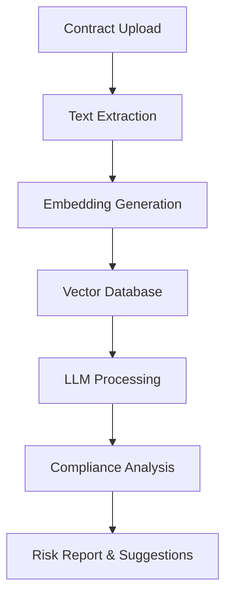

<h1 align="center">⚖️ AI Regulatory Compliance Checker 🤖</h1>

<p align="center">
  
</p>

<p align="center">
  
  
  
  
</p>

---

## 🚀 Project Overview

The **AI Regulatory Compliance Checker** is an advanced AI system designed to automate the review, analysis, and updating of contracts to ensure compliance with global regulatory standards such as **GDPR** and **HIPAA**.

It uses **Large Language Models (LLMs)** and **Retrieval-Augmented Generation (RAG)** to:

* Detect missing or risky clauses
* Analyze legal compliance
* Suggest improvements based on latest regulations

This system significantly reduces manual effort and minimizes compliance risks in contract management.

---
## Problem Statement 🎯

Ensuring regulatory compliance in AI systems is complex and time-consuming. This project provides an AI-powered solution to analyze and validate compliance.

---
## 🎯 Key Features

✔️ Automated contract compliance checking

✔️ AI-based risk assessment & clause detection

✔️ Smart recommendations using LLMs

✔️ Real-time regulatory updates integration

✔️ Multi-source data ingestion (Google Sheets, web, emails)

✔️ Scalable and efficient RAG architecture

---

## 🧠 System Architecture



---

## 🛠️ Tech Stack

| Category     | Tools Used                  |
| ------------ | --------------------------- |
| Language     | Python 3.11+                |
| LLMs         | OpenAI GPT, Meta LLaMA      |
| Frameworks   | LangChain, LlamaIndex       |
| Vector DB    | FAISS / Pinecone            |
| Data Sources | Google Sheets, Web APIs     |
| Processing   | AsyncIO                     |
| Deployment   | Docker (Planned), Terraform |

---

## ⚡ Advanced Capabilities

* 🔍 **RAG Architecture**: Retrieval from large legal datasets (500+ pages)
* ⚡ **Async Processing**: Faster, non-blocking API calls
* 💾 **Quantized Embeddings**: Optimized memory usage
* 🌍 **Multi-Jurisdiction Support**: GDPR, HIPAA, and more

---

## 📊 Performance Metrics

| Metric   | Before Optimization | After Optimization |
| -------- | ------------------- | ------------------ |
| Latency  | 4.2s                | 0.8s               |
| Accuracy | 72%                 | 94%                |

---

## 🎬 Demo Preview

<p align="center">
  <a href="https://www.youtube.com/watch?v=Q1jS9WCM0wA">
    
  </a>
</p>

<p align="center">
  🎥 Click the image above to watch the full demo
</p>

---

## ⚙️ Installation & Setup

```bash
git clone https://github.com/ruchikakengal/AI-Powered-Regulatory-Compilance-Checker.git
cd AI-Powered-Regulatory-Compliance-Checker

python -m venv venv
venv\Scripts\activate   # Windows
source venv/bin/activate  # Mac/Linux

pip install -r requirements.txt
streamlit run app.py
```

---

## 🔮 Future Enhancements

* 📄 Automated PDF compliance reports
* 🌐 Multi-language legal support
* 📊 Advanced analytics dashboard
* 🔗 Live regulatory API integration
* 🤖 Fully conversational AI assistant

---

## 👩‍💻 Author

**Ruchika Kengal**
💻 CSE Student | AI & Web Developer

---

## ⭐ Support

If you like this project, give it a ⭐ on GitHub!

---
## 🦹🏻‍♀️ Contributions
If you'd like to contribute to this Project, please fork the repository and create a pull request with your features or fixes. 

---

## 📄 License

This project is licensed under the MIT License.


